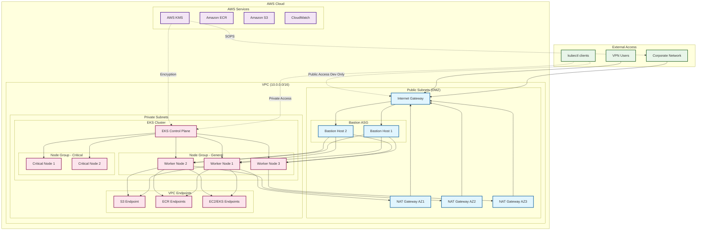

# Kubula - Production-Ready EKS Infrastructure with Terragrunt

A comprehensive Infrastructure as Code (IaC) solution for deploying secure, scalable AWS EKS clusters using Terragrunt, featuring network isolation, bastion hosts, and secrets management with SOPS.

## Architecture Overview



## Features

- **Security First**: Private EKS nodes, bastion hosts in DMZ, SOPS encryption
- **Network Isolation**: Multi-AZ VPC with public/private subnet separation
- **High Availability**: Multi-AZ deployment with redundant NAT gateways
- **Secrets Management**: SOPS integration with AWS KMS for secure secret storage
- **Observability**: CloudWatch logs, VPC flow logs, and monitoring
- **Cost Optimized**: Environment-specific configurations (SPOT for dev, ON_DEMAND for prod)
- **Production Ready**: Following AWS and Terragrunt best practices

## Prerequisites

- [AWS CLI](https://aws.amazon.com/cli/) configured with appropriate profiles
- [Terraform](https://www.terraform.io/) >= 1.0
- [Terragrunt](https://terragrunt.gruntwork.io/) >= 0.45.0
- [SOPS](https://github.com/mozilla/sops) >= 3.7.0
- [kubectl](https://kubernetes.io/docs/tasks/tools/) for cluster interaction
- AWS KMS keys for SOPS encryption

## Quick Start

### 1. Clone the Repository

```bash
git clone https://github.com/mkm29/kubula.git
cd kubula
```

### 2. Configure AWS Accounts

Update the account configuration files:
- `infrastructure-live/dev/account.hcl`
- `infrastructure-live/prod/account.hcl`

### 3. Set Up KMS Keys

```bash
# Create KMS keys for SOPS
aws kms create-alias --alias-name alias/kubula-dev \
  --target-key-id $(aws kms create-key --description "SOPS key for dev" \
  --query 'KeyMetadata.KeyId' --output text) --profile terraform-eks
```

### 4. Configure Secrets

```bash
# Edit and encrypt secrets
sops secrets/dev/common.yaml
sops secrets/prod/common.yaml
```

### 5. Deploy Infrastructure

```bash
# Deploy dev environment
cd infrastructure-live/dev/us-east-1
terragrunt run-all apply

# Deploy prod environment
cd infrastructure-live/prod/us-east-1
terragrunt run-all apply
```

## 6. Project Structure

```
├── infrastructure-live             # Terragrunt configurations
│   ├── _envcommon                  # Shared configurations
│   ├── dev                         # Development environment
│   ├── prod                        # Production environment
│   └── terragrunt.hcl
├── secrets                         # SOPS-encrypted secrets
│   ├── dev
│   └── prod
├── terraform-modules               # Reusable Terraform modules
│   ├── bastion                     # Bastion host with auto-scaling
│   ├── eks                         # EKS cluster and node groups
│   ├── iam                         # _TODO_
│   └── vpc                         # VPC with public/private subnets
├── .sops.yaml                      # SOPS configuration 
```

## 7. Configuration

### Environment Variables

Each environment has its own configuration:
- VPC CIDR ranges
- Instance types and sizes
- High availability settings
- Cost optimization features

### Secrets Management

Sensitive data is managed with SOPS:
- SSH key names
- Allowed CIDR blocks
- API access configurations

## 8. Security Features

- **Network Isolation**: Worker nodes in private subnets
- **Bastion Access Control**: Restricted to specific CIDR blocks
- **Encryption**: SOPS for secrets, KMS for EKS secrets
- **IAM**: Least privilege with IRSA support
- **VPC Endpoints**: Private AWS service communication
- **Audit Logging**: CloudWatch and VPC flow logs

## 9. Monitoring & Logging

- EKS control plane logs
- VPC flow logs to S3
- CloudWatch logs for bastion hosts
- Metrics for auto-scaling groups

## 10. Maintenance

### Updating EKS Version

1. Update `cluster_version` in configuration
2. Apply changes with Terragrunt
3. Update node groups if needed

### Rotating Secrets

```bash
sops secrets/env/common.yaml
```

## 11. Cost Optimization

- **Dev**: `SPOT` instances, single NAT gateway
- **Prod**: `ON_DEMAND` instances, multi-AZ NAT gateways
- **Auto-scaling**: Right-sized infrastructure
- **VPC Endpoints**: Reduced data transfer costs

## 12. Contributing

1. Fork the repository
2. Create a feature branch
3. Commit your changes
4. Push to the branch
5. Create a Pull Request

## 13. License

This project is licensed under the MIT License - see the LICENSE file for details.

## 14. Documentation

For detailed documentation, see [README-terragrunt.md](README-terragrunt.md)

## 15. Support

- Create an issue for bug reports
- Check existing issues before creating new ones
- Provide detailed information for troubleshooting

---

Built using Terragrunt and AWS